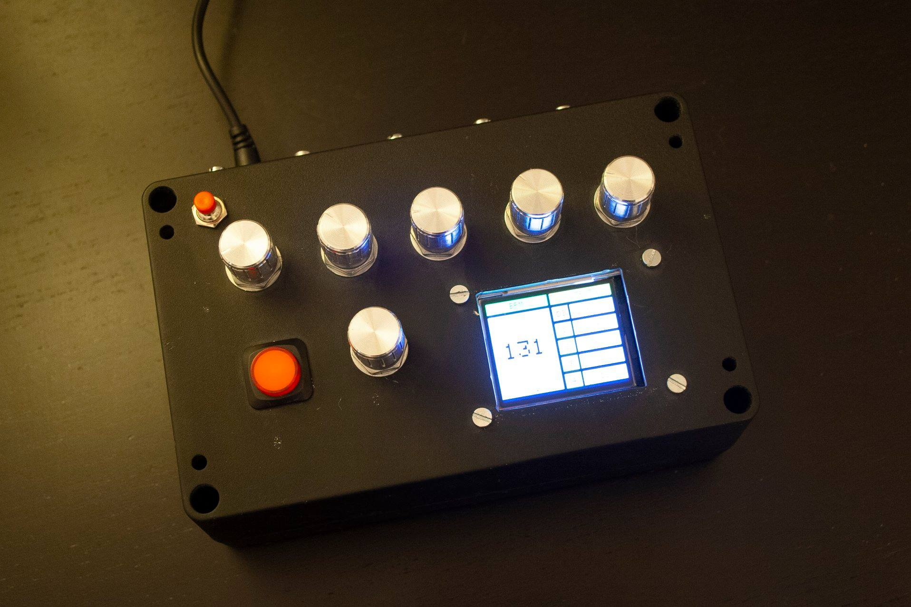

# CLOCKBOX
Prototype Midi/DinSync Master Clock Generator with clock offset capability per output
  
### Parts list 
..* 1x ST7735 SPI TFT 128x160 Display 
..* 6x 10k Linear potentiometer 
..* 1x Teensy 4.0 (Or 3.2) 
..* 4x 47ohm resistors 
..* 5x midi DIN sockets 
..* 1x Start/Stop button 
..* 1x Save button 
..* Enclosure 
..* Power socket 
..* 5V 2A PSU 
  

